# Incident Investigation Report
**Date:** November 4, 2025  
**Incident Period:** October 31, 2025 01:14 - 01:19 UTC  
**Reported Issue:** Users unable to complete orders

## Executive Summary

Analysis of service logs reveals **3 critical order failures** out of 42 total order attempts (7% failure rate) during the incident window. Failures occurred at three different stages of the order processing pipeline, affecting distinct users and involving multiple service instances.

## Affected Users & Impact

| User ID | Failed Stage | Order ID | Root Cause | Impact |
|---------|-------------|----------|------------|--------|
| user003 | Data Lookup | N/A | Data service timeout (5s) | Unable to proceed with order |
| user005 | Payment Processing | ORD-0004 | Payment gateway timeout | Order created but not paid ($440.46) |
| user007 | Order Creation | ORD-0006 | OutOfMemoryError | Unable to create order despite valid session |
| user008 | Data Lookup | N/A | Data service timeout (5s) | Unable to proceed with order |

## Critical Errors Requiring Immediate Attention

### 🔴 **Priority 1: Data Service Timeouts (Instance 2)**
- **Occurrences:** 2 failures
- **Affected Users:** user003, user008
- **Error:** `Data lookup timeout for user {userId} after 5000ms`
- **Time:** 01:15:10 and 01:17:40 UTC
- **Impact:** Complete order flow blockage - users cannot proceed past data retrieval
- **Action Required:** 
  - Investigate Data Service instance 2 performance degradation
  - Check database connection pool exhaustion
  - Review query performance and indexes
  - Consider reducing timeout threshold or implementing retry logic

### 🔴 **Priority 1: Order Service Memory Issues (Instance 0)**
- **Occurrences:** 1 failure
- **Affected User:** user007
- **Error:** `Failed to create order ORD-0006: OutOfMemoryError`
- **Time:** 01:17:08 UTC
- **Impact:** Critical service availability issue
- **Action Required:**
  - Immediate memory analysis of Order Service instance 0
  - Review heap dump and identify memory leak
  - Check for large object allocations or memory retention
  - Consider restarting instance and increasing heap size
  - Implement memory monitoring alerts

### 🟡 **Priority 2: Payment Gateway Timeout (Instance 3)**
- **Occurrences:** 1 failure
- **Affected User:** user005
- **Error:** `Payment failed for order ORD-0004: Payment gateway timeout`
- **Time:** 01:16:10 UTC
- **Amount at Risk:** $440.46
- **Impact:** Order created but unpaid, potential reconciliation issue
- **Action Required:**
  - Verify order ORD-0004 payment status with gateway
  - Implement idempotent retry mechanism for payment processing
  - Review payment gateway SLA and timeout configurations
  - Add monitoring for payment processing duration

## Event Flow Analysis

### Successful Order Flow (Normal Operations)

### Failure Scenarios

```mermaid
flowchart TB
    Start[User Login] -->|Success| DataCheck{Data Lookup}
    
    DataCheck -->|Timeout 5s| Fail1[❌ Data Service Timeout]
    DataCheck -->|Success| OrderCheck{Order Creation}
    
    OrderCheck -->|OutOfMemoryError| Fail2[❌ Order Service Failure]
    OrderCheck -->|Success| PaymentCheck{Payment Processing}
    
    PaymentCheck -->|Gateway Timeout| Fail3[❌ Payment Failure]
    PaymentCheck -->|Success| Success[✅ Order Fulfillment]
    
    Fail1 -.->|Affected| U1[user003, user008]
    Fail2 -.->|Affected| U2[user007]
    Fail3 -.->|Affected| U3[user005]
    
    style Fail1 fill:#FF6B6B
    style Fail2 fill:#FF6B6B
    style Fail3 fill:#FFB84D
    style Success fill:#90EE90
    style U1 fill:#FFF3CD
    style U2 fill:#FFF3CD
    style U3 fill:#FFF3CD
```

### Detailed Timeline of Failures

## Service Health Summary

| Service | Total Instances | Affected Instances | Error Count | Status |
|---------|----------------|-------------------|-------------|--------|
| Data Service | 3 | Instance 2 | 2 | 🔴 Degraded |
| Order Service | 3 | Instance 0 | 1 | 🔴 Critical |
| Payment Service | 4 | Instance 3 | 1 | 🟡 Warning |
| User Service | 2 | Instance 0 | 1 (login failure) | 🟢 Healthy |

**Note:** User Service error was unrelated authentication failure (incorrect password) for user011, not an order completion issue.

## Error Statistics

- **Total Events Processed:** 154 log entries
- **Total Trace Events:** 42 order attempts
- **Successful Orders:** 37 (88%)
- **Failed Orders:** 3 (7%)
- **Timeout Orders:** 2 (5%)
- **Error Level Logs:** 5
- **Warning Level Logs:** 1

## Root Cause Analysis

### 1. Data Service Performance Degradation (Instance 2)
- **Symptom:** 5-second timeouts on data lookup operations
- **Pattern:** Only affecting instance 2, not instances 0 or 1
- **Hypothesis:** Database connection issues, network latency, or resource exhaustion on specific instance
- **Evidence:** Both failures occurred on same instance with identical timeout duration

### 2. Order Service Memory Leak (Instance 0)
- **Symptom:** OutOfMemoryError during order creation
- **Pattern:** Single occurrence but critical impact
- **Hypothesis:** Memory leak, insufficient heap size, or large object allocation
- **Evidence:** Service was able to process previous orders successfully, suggesting gradual memory buildup

### 3. Payment Gateway Integration Issues
- **Symptom:** Timeout communicating with external payment gateway
- **Pattern:** Isolated incident on instance 3
- **Hypothesis:** External dependency timeout, network issues, or gateway-side latency
- **Evidence:** Order was successfully created, indicating upstream services healthy

## Recommendations

### Immediate Actions (0-24 hours)
1. **Restart Order Service instance 0** with increased heap memory
2. **Investigate Data Service instance 2** database connections and query performance
3. **Verify payment status** for order ORD-0004 and manually complete if needed
4. **Enable verbose logging** on affected service instances for continued monitoring

### Short-term Actions (1-7 days)
1. Implement **circuit breaker pattern** for external payment gateway calls
2. Add **retry logic with exponential backoff** for data lookup operations
3. Configure **memory alerts** at 80% heap utilization threshold
4. Implement **distributed tracing** for end-to-end order flow visibility
5. Add **timeout monitoring dashboards** for all service dependencies

### Long-term Actions (1-4 weeks)
1. Conduct **load testing** to identify service capacity limits
2. Implement **auto-scaling** for service instances based on memory and CPU metrics
3. Add **chaos engineering** tests for timeout and failure scenarios
4. Review and optimize **database query performance** in Data Service
5. Implement **payment reconciliation service** for failed payment recovery
6. Add **user-facing retry mechanisms** for recoverable errors

## Monitoring & Alerting Gaps

Based on this incident, the following alerts should be configured:
- ⚠️ Data lookup operations exceeding 3 seconds
- ⚠️ Service memory utilization above 80%
- ⚠️ Payment gateway response time above 2 seconds
- ⚠️ Any service instance reporting errors at >1% rate
- ⚠️ Failed order rate above 2% in any 5-minute window

## Business Impact

- **Revenue at Risk:** $440.46 (order ORD-0004 pending payment recovery)
- **Customer Experience:** 3 users experienced order failures requiring manual intervention
- **Availability:** 93% success rate during incident window
- **Reputation Risk:** Medium - users may retry or contact support

---

**Prepared by:** SRE Incident Analysis System  
**Next Review:** Monitor for 48 hours post-remediation
