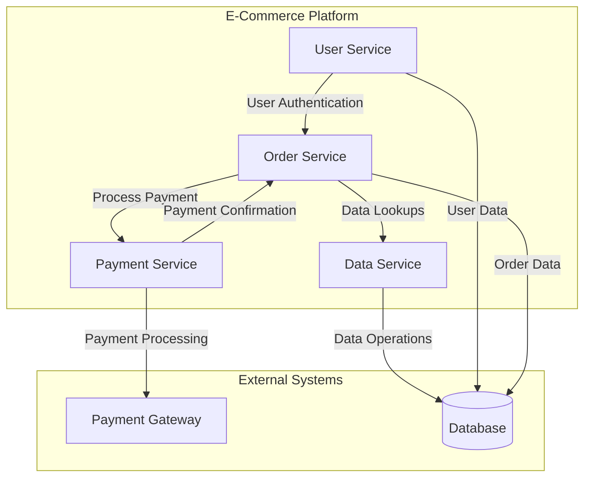
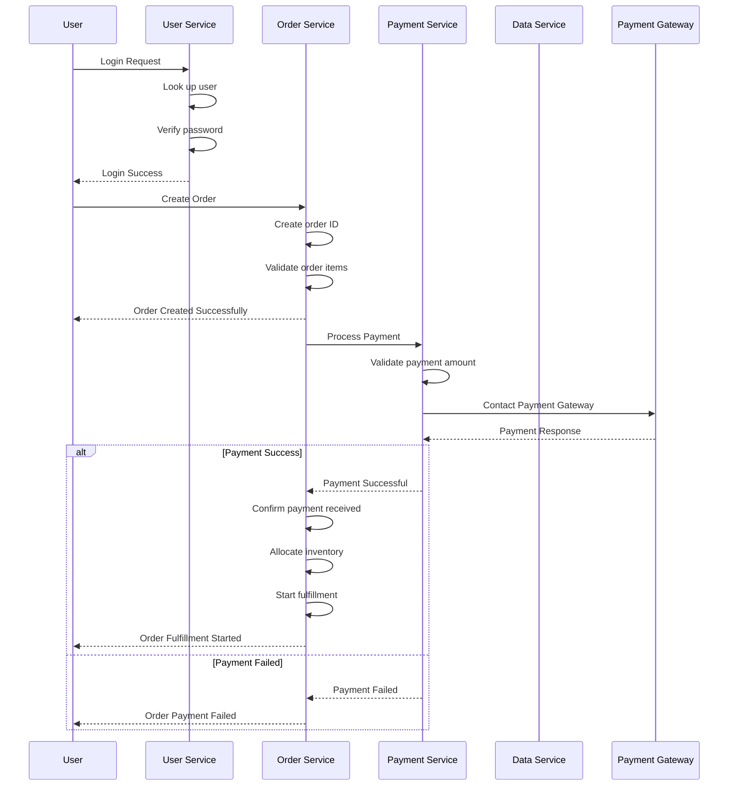
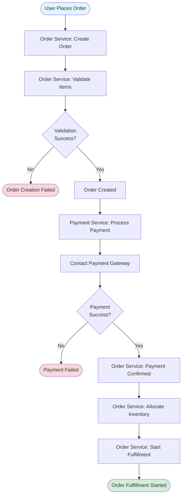

# Order Processing Flow

## Overview

This document describes the end-to-end order processing flow for the e-commerce platform, including all services involved and their interactions.

## Services

The platform consists of four main services:

1. **User Service** - Manages user authentication and profiles
2. **Order Service** - Processes customer orders and manages order lifecycle
3. **Payment Service** - Handles payment processing via payment gateway
4. **Data Service** - Handles data operations and lookups

## Service Architecture

## Order Processing Flow

### Complete Order Lifecycle Sequence

## Event Types

The system tracks the following event types:

1. **user_login** - User authentication events
2. **order_creation** - Order creation and validation
3. **payment_processing** - Payment processing via gateway
4. **order_fulfillment** - Order fulfillment and inventory allocation
5. **data_lookup** - Data retrieval operations

## Order Processing Steps

### 1. Order Creation
- **Service**: Order Service
- **Steps**:
  1. Receive order creation request from user
  2. Generate unique order ID
  3. Validate order items
  4. Create order record
  5. Return order confirmation

### 2. Payment Processing
- **Service**: Payment Service
- **Steps**:
  1. Receive payment request from Order Service
  2. Validate payment amount
  3. Contact external payment gateway
  4. Process payment response
  5. Return payment result (success/failure)

### 3. Order Fulfillment
- **Service**: Order Service
- **Steps**:
  1. Receive payment confirmation from Payment Service
  2. Allocate inventory for the order
  3. Initiate fulfillment process
  4. Calculate estimated delivery date
  5. Update order status

## Error Handling

The system handles various failure scenarios:

- **Order Creation Failures**: OutOfMemoryError, validation errors
- **Payment Failures**: Payment gateway timeout, insufficient funds, invalid payment details
- **Data Lookup Failures**: Timeout, connection errors

## Flow Diagram: Successful Order

## Key Observations

1. **Sequential Processing**: Orders are processed in a sequential manner: Creation → Payment → Fulfillment
2. **Service Isolation**: Each service handles its specific domain (user, order, payment, data)
3. **Event Tracking**: All operations are tracked via trace events with status monitoring
4. **Multiple Instances**: Each service runs multiple instances for scalability and reliability
5. **External Dependencies**: Payment service depends on external payment gateway
6. **Failure Recovery**: System handles failures gracefully at each stage (order creation, payment processing)

## Status Tracking

Each trace event has a status:
- `success` - Operation completed successfully
- `failed` - Operation failed with error details logged
